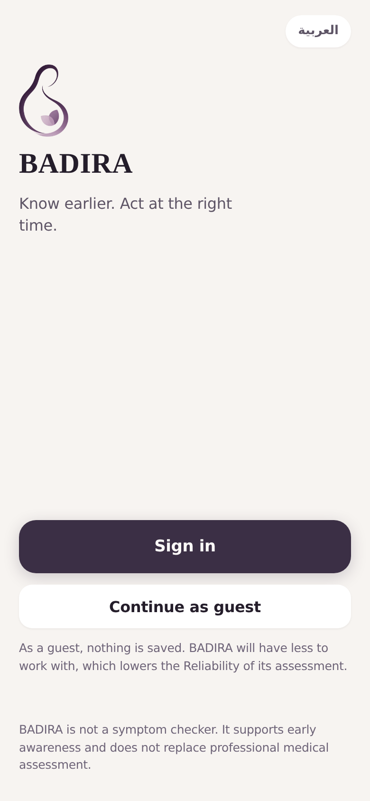
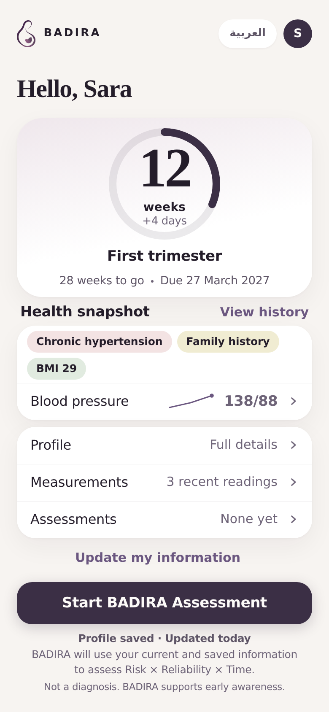
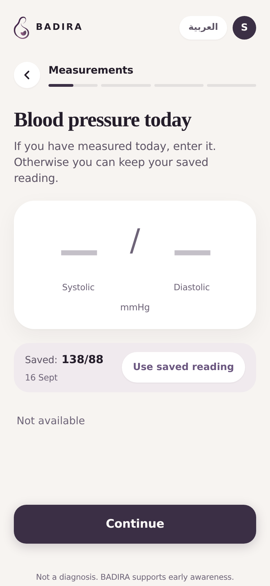
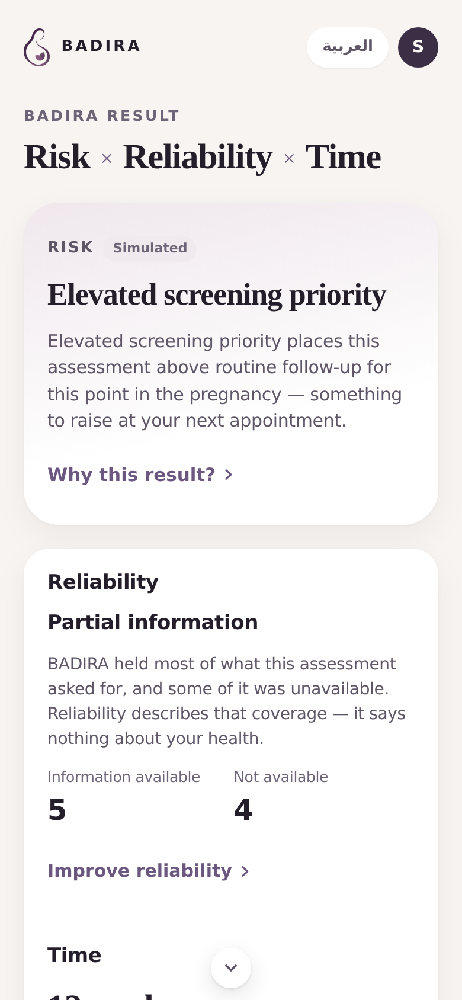
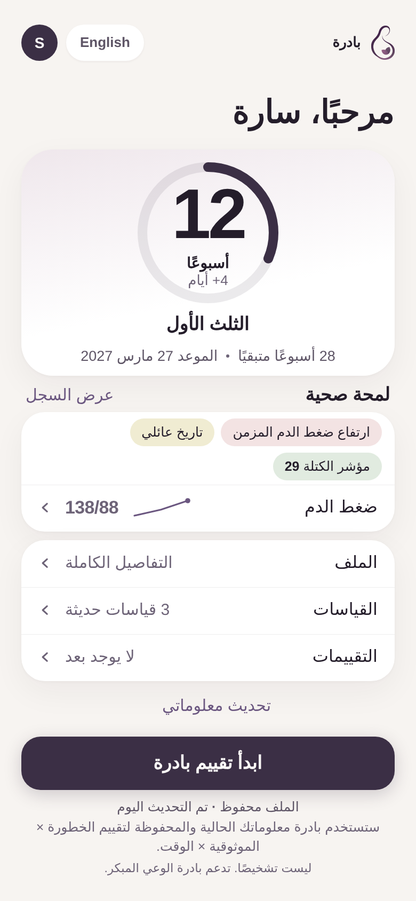

<div align="center">

# BADIRA | بادرة

**A bilingual, mobile-first prototype for earlier awareness of preeclampsia risk in pregnancy.**

### 🌐 [**Live Prototype — badira-ai.netlify.app**](https://badira-ai.netlify.app)

[](https://badira-ai.netlify.app)
[](#project-status)
[](#key-features)
[](LICENSE)

</div>

> **BADIRA supports awareness and screening prioritization. It is not a diagnostic
> tool and does not replace professional medical assessment.**

---

## Overview

BADIRA is a bilingual Arabic/English, mobile-first prototype that explores how
AI-supported risk awareness could help pregnant women understand when additional
screening or medical attention may be appropriate.

Rather than presenting a single number, BADIRA separates three things a woman
actually needs in order to act: what the assessment suggests, how complete the
information behind it is, and where she is in her pregnancy. The interface is
designed to be readable by someone with no clinical background, in either
language, on a phone.

## The Problem

Indicators relevant to pregnancy risk can be present before a woman has reason to
think additional screening might be appropriate. At the same time, the
information that would make such an assessment meaningful is often incomplete,
spread across appointments, or difficult for a non-specialist to interpret.

A tool that answers confidently regardless of what it actually knows is not
helpful here. BADIRA is built around the opposite instinct: be clear about what
is known, what is missing, and when it matters.

## Our Solution

BADIRA presents every assessment as three readings side by side, never combined
into a single score:

### Risk × Reliability × Time

| | |
| --- | --- |
| **Risk** | The screening-priority result for the assessment. This is the position a validated clinical risk model will occupy. In the current prototype it is presented as a clearly labelled simulated demonstration result, not a prediction. |
| **Reliability** | How complete the information available for this assessment was. When something is missing, BADIRA names it instead of quietly assuming a value. Reliability describes coverage of information — never the person's health. |
| **Time** | Where the assessment sits in the pregnancy, from the recorded gestational timing. |

Keeping the three apart is the point. A reading based on partial information is
shown as exactly that, and the user is told what would strengthen it.

## Key Features

- **Bilingual interface** — full English and Arabic, with right-to-left layout
- **Mobile-first experience** — designed for a phone, from a 390 × 844 viewport up
- **Pregnancy timeline** — gestational age, trimester and progress at a glance
- **Health snapshot** — saved factors and the latest recorded measurements
- **Guided assessment** — an adaptive flow that only asks what is relevant
- **Risk × Reliability × Time result** — three readings, presented separately
- **Information completeness awareness** — what BADIRA had, what it did not, and what would help
- **Assessment history** — previous assessments, reopenable with their original result
- **Profile and health information management** — sectioned, resumable, partially completable
- **Detailed report and share summary** — a readable summary to bring to an appointment
- **Light and dark themes** — follows the system setting
- **Responsive presentation** — phone layout on mobile, framed device view on desktop

## Prototype

The prototype runs entirely in the browser — no installation, no account, no data
leaves the device.

### 🌐 **[badira-ai.netlify.app](https://badira-ai.netlify.app)**

Open it on a phone for the intended experience, or on a laptop, where it is
presented inside a device frame. Use the toggle in the header to switch between
English and العربية at any point.

## Screenshots

<div align="center">
<table>
<tr>
<td width="20%"></td>
<td width="20%"></td>
<td width="20%"></td>
<td width="20%"></td>
<td width="20%"></td>
</tr>
<tr>
<td align="center"><sub><b>Welcome</b></sub></td>
<td align="center"><sub><b>Home</b></sub></td>
<td align="center"><sub><b>Assessment</b></sub></td>
<td align="center"><sub><b>Result</b></sub></td>
<td align="center"><sub><b>العربية</b></sub></td>
</tr>
</table>
</div>

## How BADIRA Works

1. **Enter or review** pregnancy and health information — profile sections can be
   filled in any order and left partially complete
2. **Complete the guided assessment** — questions adapt to the answers given, and
   anything unavailable can be skipped
3. **BADIRA evaluates what it had to work with** — how much of the requested
   information was actually available
4. **View the result** — Risk, Reliability and Time, each read separately. In this
   prototype the Risk reading is a labelled simulated demonstration result, not a
   validated clinical prediction
5. **Review or update information** — the result names what was missing, so it is
   clear what would make the next assessment more informative

## Technology

| Concern | Choice |
| --- | --- |
| Build tool | Vite 5 |
| UI | React 18 + TypeScript (strict mode) |
| Routing | React Router 6 |
| Styling | Plain CSS with design tokens — no UI framework |
| Internationalisation | In-repo dictionaries, no dependency |

Three runtime dependencies in total. The stack was chosen to keep the prototype
fast to iterate on and free of anything that would have to be unpicked later.

## Project Status

**SmartStart prototype.**

This repository contains the complete, working BADIRA prototype used to
demonstrate the product concept and the full user experience. All three product
stages — profile, guided assessment, and the Risk × Reliability × Time result —
are built and usable end to end, in both languages.

The Reliability and Time readings are genuinely determined from each assessment.
The Risk reading is a fixed demonstration result, labelled as simulated
throughout the interface: **a validated clinical prediction model is not
connected.** The architecture keeps a clear seam for one — the assessment
specification and the Risk output are isolated so that the engine, the screens
and the state layer do not change when a validated model arrives.

There is no authentication, database, or external API; nothing persists beyond
the session.

## Team

| | |
| --- | --- |
| **Dana Al Mounayer** | CS AI |
| **Judy Al Imam** | CS AI |

## Disclaimer

BADIRA is a prototype designed for awareness and educational demonstration. It is
not a diagnostic tool and does not replace evaluation, diagnosis, or treatment by
qualified healthcare professionals.

## Running Locally

Requires **Node.js 20+** and **npm 10+**.

```bash
npm install
npm run dev        # dev server at http://localhost:5173/
```

| Command | Does |
| --- | --- |
| `npm run dev` | Start the dev server with hot reload |
| `npm run build` | Type-check, then build to `dist/` |
| `npm run preview` | Serve the production build locally |
| `npm run typecheck` | Type-check only |

The layout targets a ~390px-wide viewport and centres itself on larger screens —
use your browser's device toolbar, or the `Network:` URL Vite prints to open it
on a phone on the same network.

### Repository layout

```
src/
  app/          Routes and session state
  components/   Shell, and per-screen components
  screens/      Welcome, Home, onboarding, profile, assessment, result, histories
  domain/       Gestation, profile sections, assessment spec and engine, result model
  i18n/         Language provider and the EN/AR dictionaries
  styles/       Design tokens, global styles, desktop presentation frame
docs/           Screen map and implementation checkpoint
```

Adding a string means adding the key to `src/i18n/en.ts` and its Arabic value to
`src/i18n/ar.ts` — the type checker fails the build if either is missing, so the
two languages cannot drift apart.

## License

MIT — see [LICENSE](LICENSE).
