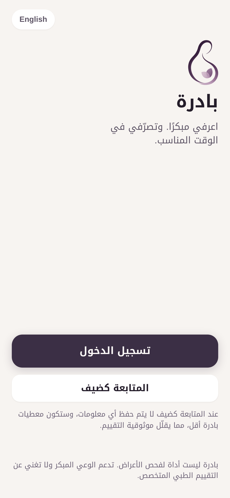
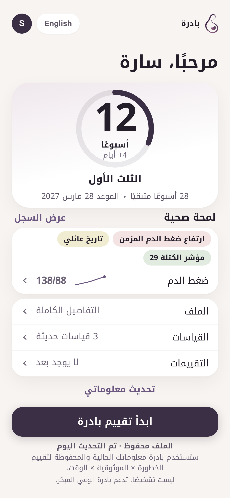
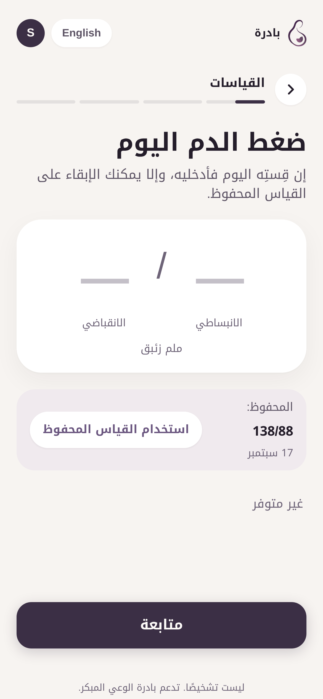
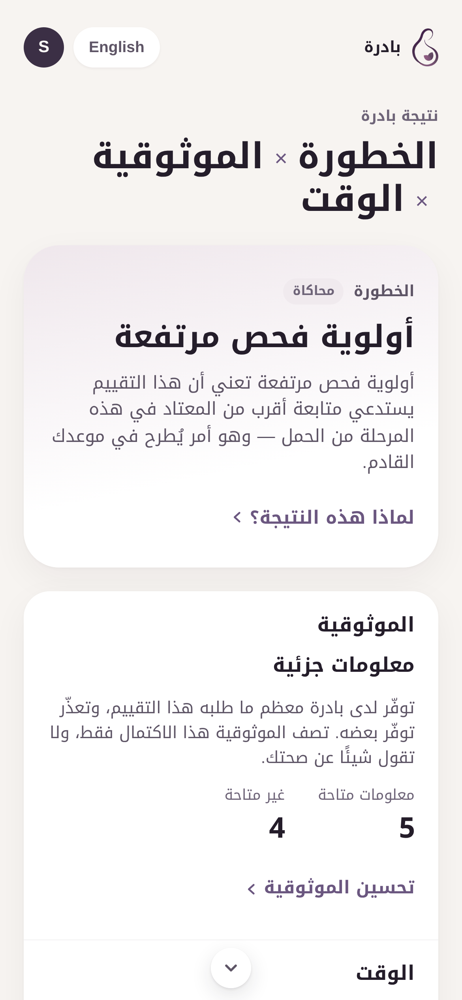

# Prototype v1 — Stage 1

The working prototype pitched in the StartSmart first round.

**The code is this repository.** It is not duplicated here — the prototype at the repository root
(`src/`, `public/`, `index.html`) *is* prototype v1. This folder records that fact and holds the
screenshots as they stood at the end of Stage 1.

| | |
|---|---|
| **Live prototype** | See the links in the [repository README](../../../README.md) |
| **Source** | [`src/`](../../../src) at the repository root |
| **Architecture** | [`docs/APP_MAP.md`](../../../docs/APP_MAP.md) |

---

## What it does

Bilingual Arabic/English, mobile-first, running entirely in the browser — no installation, no
account, no data leaving the device.

- Pregnancy timeline — gestational age, trimester, progress
- Health snapshot — saved factors and latest measurements
- Guided assessment — an adaptive flow that only asks what is relevant
- **Risk × Reliability × Time** result — three readings, presented separately
- Information-completeness awareness — what BADIRA had, what it did not, what would help
- Assessment history, detailed report and share summary
- Light and dark themes, full right-to-left layout

---

## Screenshots (Arabic interface)

| Welcome | Home | Assessment | Result |
|---|---|---|---|
|  |  |  |  |

---

> **Not a diagnostic tool.** The risk reading in v1 is a clearly labelled simulated demonstration
> result, not a prediction. It marks the position a validated clinical model will occupy.
