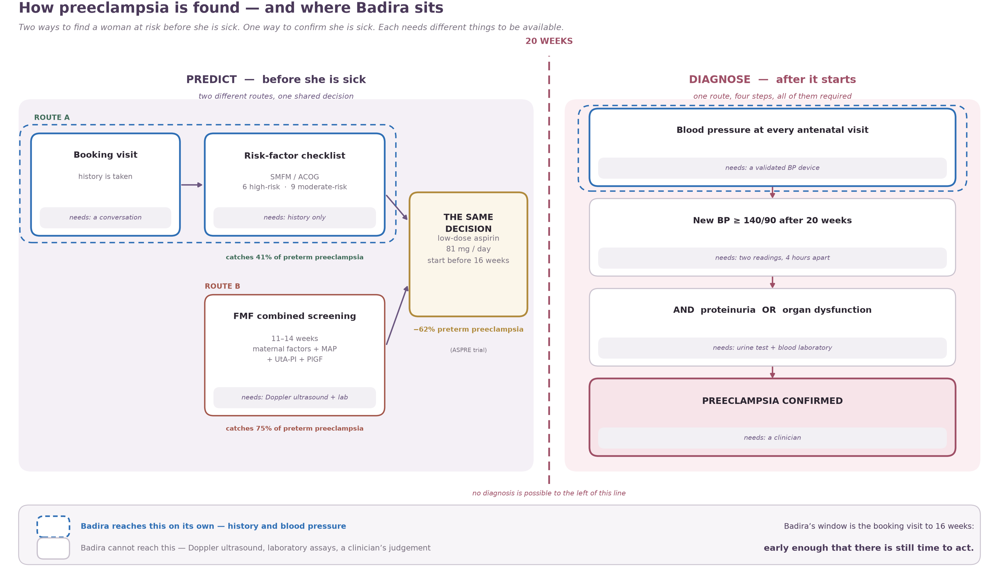

# Task 1 — Clinical Understanding

Building a real clinical understanding of how preeclampsia is detected, before any modelling begins.

## The deliverable

**[`Report-Task-1.pdf`](Report-Task-1.pdf)** — the combined report. Three separate pieces of research,
joined into one argument with a single spine:

> There are two ways to find a woman at risk before she is sick, and one way to confirm she is sick.
> Each needs different things to be available.

| Part | Covers |
|---|---|
| 1 | What preeclampsia is, and what counts as a diagnosis — including the 20-week line that separates prediction from diagnosis |
| 2 | **Route A** — the history-only SMFM/ACOG risk-factor checklist, and the aspirin decision it leads to |
| 3 | **Route B** — FMF first-trimester combined screening, what it requires, and how the alternatives compare |
| 4 | The two routes side by side — same decision, different evidence, different availability |
| 5 | Biomarkers — what research measures to predict preeclampsia before anything is clinically visible |

## The figure

[`figures/Figure-1-How-Preeclampsia-Is-Found.png`](figures/Figure-1-How-Preeclampsia-Is-Found.png) —
the whole picture on one page: two prediction routes converging on one decision before 20 weeks, one
diagnostic chain after it, and the three boxes BADIRA can fill on its own.

## Files

| File | What it is |
|---|---|
| `Report-Task-1.pdf` / `.docx` | The combined report |
| `figures/` | Figure 1, as PNG and PDF |
| `source-research/` | The three original research documents, before they were joined |
| `Task-1-Brief.pdf` | The task brief this work answers |

## The three source documents

| | Document | Ends at |
|---|---|---|
| 1 | Clinical definition of preeclampsia | "an AI risk score is not a diagnosis" |
| 2 | Risk-factor screening | aspirin 81 mg, before 16 weeks |
| 3 | FMF first-trimester screening | "clinical prevention / follow-up" |

Documents 2 and 3 end at the same clinical decision by two different routes, and neither said so
until they were put in one report. That join is the point of the task.
